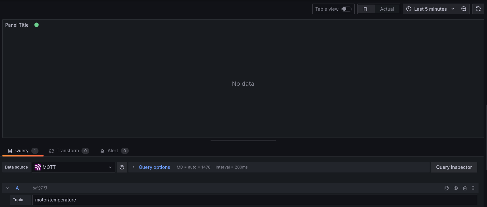

# Loginator

This project acts as a bridge between a VEX robot and an mqtt broker. The output from this broker can then be sent to listened to by a Grafana instance. 

You can find more information about those services here:
- https://grafana.com/docs/
- https://mosquitto.org/documentation/

## Installation

Currently cargo install is the only supported method for installation. This may change once there is a stable release.

```sh
cargo install --git https://github.com/BattleCh1cken/loginator
```
Make sure that `$HOME/.cargo` is added to `$PATH`.

You can then run it like so:

```sh
loginator --help
```


## Configuration

Once you've installed, generate a new config by running the program once.

```sh
loginator
```
The configuration file can be found at:
- Linux: `/home/USERNAME/.config/loginator/`
- Windows: `%appdata%\loginator\config\`

Once you have your config you'll need to configure it to match your brain. The first thing you'll need to do is make your V5 brain bluetooth capable. Follow [these](https://kb.vex.com/hc/en-us/articles/360044904552-Configuring-the-V5-Brain-for-Coding-over-Bluetooth) steps to enable bluetooth.

Once you've done that, connect your radio and turn your brain on. Then run:
```sh
loginator list-brains
```

This will print out all of the available brains. Change the brain name in your config file to match your brain's name. The name can be changed by changing your robot name.

```toml
# config.toml
brain_name = 'VEX_V5'
```

Then run:
```sh
loginator display-code
```

This will display the brain's bluetooth 4 digit authentication code on it's LCD screen. Change the code in the config to match.

```toml
# config.toml
brain_code = '0000'
```

Now you'll need to configure your routes. These are the MQTT topics and labels for the data that the brain will be emitting.

You'll then need to set your brain up to emit telemetry data. Install the [LemLib](https://lemlib.github.io/LemLib/md_docs_tutorials_1_getting_started.html) template.

You can log telemetry like so:

```cpp
#define TEMPERATURE_ROUTE 0
lemlib::telemetrySink()->debug("{},{},{}", TEMPERATURE_ROUTE, motor1.get_temperature(), motor2.get_temperature());

// Currently the loginator will only work with debug messages
```

The loginator expects data in the form of numbers separated by commas. The first digit corresponds with the route, and the rest are the actual data. In order to use this data we'd have to define the following route in our config.toml:
```toml
#config.toml

routes = [
    [
    'motors/temperature',
    [
    'First motor',
    'Second motor',
],
]
```

In this case we specified 0 as our route, meaning that the loginator will use the first route in the array of routes.

## Setting up Mosquitto

Instructions to install Mosquitto can be found [here](https://mosquitto.org/download/).

You can verify that its working by running:
```sh
mosquitto_sub -h localhost -t motors/temperature
```

## Setting Up Grafana

Instructions to install Grafana can be found [here](https://grafana.com/grafana/download).

Once it's installed, you'll need to configure your dashboard. Add MQTT as a datasource and create a new visualization.



Click apply and you're good to go!

## Connecting to the Brain

Run:

```sh
loginator connect
```

The loginator will now connect to the brain with your configured name. All messages sent via LemLib telemetry will now be sent to MQTT!
